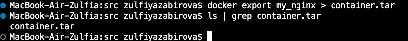

## Part 1

#### Возьми официальный докер-образ с nginx и выкачай его при помощи docker pull.

- установила Докер десктоп, залогинилась. установила расширения для vscode Docker и Remote - Containers
- залогинилась в терминале с помощью 

```
docker login
```
- проверила работу docker с помощью 

```
docker --version
```
- Скачала образ nginx с помощью 

```
doker pull nginx
```


- Проверила командой 

```
docker images
```


#### Запусти докер-образ через docker run -d [image_id|repository].

- Запускаем в фоновом режиме (-d),
- задаем имя контейнера (--name my-nginx), 
- перенаправляем порт 8080 на хосте к порту 80 в контейнере, на котором работает Nginx (-p 8080:80), 
- имя репозитория образа (nginx). 
- Выдает ID запущенного контейнера:


#### Проверь, что образ запустился через docker ps.


#### Посмотри информацию о контейнере через docker inspect [container_id|container_name].


- Размер контейнера:  
```
docker ps -s
```


- IP адресс: 


- Замапленные порты:


#### Останови докер контейнер через docker stop [container_id|container_name].


#### Проверь, что контейнер остановился через docker ps.


#### Запусти докер с портами 80 и 443 в контейнере, замапленными на такие же порты на локальной машине, через команду run.


#### Проверь, что в браузере по адресу localhost:80 доступна стартовая страница nginx.


#### Перезапусти докер контейнер через docker restart [container_id|container_name].


## Part 2. Операции с контейнером

##### Прочитай конфигурационный файл nginx.conf внутри докер контейнера через команду exec.
```
docker exec -it my_nginx cat /etc/nginx/nginx.conf
```

##### Создай на локальной машине файл nginx.conf.

```
docker exec my_nginx cat /etc/nginx/nginx.conf > nginx.conf
```


##### Настрой в нем по пути /status отдачу страницы статуса сервера nginx.


##### Скопируй созданный файл nginx.conf внутрь докер-образа через команду docker cp.

```
docker cp nginx.conf my_nginx:/etc/nginx/
```


##### Перезапусти nginx внутри докер-образа через команду exec.

```
 docker exec my_nginx nginx -s reload
```


##### Проверь, что по адресу localhost:80/status отдается страничка со статусом сервера nginx.


##### Экспортируй контейнер в файл container.tar через команду export.

```
docker export my_nginx > container.tar
```



##### Останови контейнер.
```
docker stop my_nginx
```


##### Удали образ через docker rmi [image_id|repository], не удаляя перед этим контейнеры.

```
docker rmi -f nginx
```
- -f - force принудительное удаление, необходимо, если образ используется контейнером


##### Удали остановленный контейнер.

```
docker ps -a - посмотреть остановленный контейнеры

docker rm my_image - удалить остановленный контейнер
```


##### Импортируй контейнер обратно через команду import.
- Когда мы запускаем импортированный контейнер, мы на этапе импорта должны явно указать, что мы должны сделать с этим контейнером после запуска с помощью флага -с . 
```
docker import container.tar my_image -c 'CMD ["nginx", "-g", "daemon off;"]'
```
- При запуске с помощью docker run, контейнер создается на основе Docker-образа, который был построен из Dockerfile. В этом Dockerfile могут быть заданы инструкции CMD или ENTRYPOINT, которые определяют, какую команду должен выполнить контейнер при запуске.
Команда docker import: архив (например, container.tar), не включает в себя информацию о том, какую команду должен выполнять контейнер при запуске. В отличие от Dockerfile, архив не содержит инструкций CMD или ENTRYPOINT.


##### Запусти импортированный контейнер.


##### Проверь, что по адресу localhost:80/status отдается страничка со статусом сервера nginx.


## Part 3. Мини веб-сервер

#### Напиши мини-сервер на C и FastCgi, который будет возвращать простейшую страничку с надписью Hello World!.
1) скачала fsgi 


2) написала скрипт на си и компилирую


#### Запусти написанный мини-сервер через spawn-fcgi на порту 8080.
1) запускаю контейнер с портом 81


2) копирую исполняемый файл мини-сервера в контейнер

```
docker cp hello_world optimistic_wright:/home
```


3) Захожу в контейнер с использованием оболочки bash и устанвливаю spawn-fcgi (порождает процессы FastCGI) libfcgi (содержит заголовочные файлы FastCGI)

```
docker exec -it elated_sammet bash
```


Запускаем мини сервер на порту 8080


#### Напиши свой nginx.conf, который будет проксировать все запросы с 81 порта на 127.0.0.1:8080.
- Прописываю необходимые параметры сервера в nginx.conf


Копирую файл конфигурации в контейнер /etc/nginx/


Перезапускаю nginx


#### Проверь, что в браузере по localhost:81 отдается написанная тобой страничка.


#### Положи файл nginx.conf по пути ./nginx/nginx.conf (это понадобится позже).

## Part 4. Свой докер

#### Напиши свой докер-образ, который:

#### 1) собирает исходники мини сервера на FastCgi из Части 3;

#### 2) запускает его на 8080 порту;

#### 3) копирует внутрь образа написанный ./nginx/nginx.conf;

#### 4) запускает nginx.


#### Собери написанный докер-образ через docker build при этом указав имя и тег.


#### Проверь через docker images, что все собралось корректно.


#### Запусти собранный докер-образ с маппингом 81 порта на 80 на локальной машине и маппингом папки ./nginx внутрь контейнера по адресу, где лежат конфигурационные файлы nginx'а (см. Часть 2).


#### Проверь, что по localhost:80 доступна страничка написанного мини сервера.


#### Допиши в ./nginx/nginx.conf проксирование странички /status, по которой надо отдавать статус сервера nginx.

 

#### Перезапусти докер-образ.
Если всё сделано верно, то, после сохранения файла и перезапуска контейнера, конфигурационный файл внутри докер-образа должен обновиться самостоятельно без лишних действий


#### Проверь, что теперь по localhost:80/status отдается страничка со статусом nginx


## Part 5. Dockle

#### Просканируй образ из предыдущего задания через dockle [image_id|repository].

- Скачала dockle:
```
brew install goodwithtech/r/dockle
```


- запустила проверку образа 

```
 dockle my_docker:3
 ```


#### Исправь образ так, чтобы при проверке через dockle не было ошибок и предупреждений.

- Исправила докерфайл и создала на его основе новый image 


```
docker build -t my_docker:4 
```


- DKL-DI-0005: Очистила кэш apt-get после установки необходимых компонентов


- CIS-DI-0001: Создала пользователя nginx и выдала ему права только для папок /src, /etc/nginx/, /var/cache/, /var/run/


- CIS-DI-0006: Добавила инструкцию HEALTHCHEC


- CIS-DI-0008: Удалила разрешения setuid и setgid, чтобы пользователь не мог повысить свои права


CIS-DI-0005: Перед билдом образа установил переменную доверия к контенту докера командой 

```
export DOCKER_CONTENT_TRUST=1
```

- CIS-DI-0010: Исключила проверку на наличие переменных окружения

```
dockle -ak NGINX_GPGKEYS -ak NGINX_GPGKEY_PATH my_docker:4
```
- Использование -ak полезно, когда вы уверены, что исключение определенных проверок безопасности для конкретных переменных окружения оправдано. Однако, в большинстве случаев рекомендовано избегать хранения чувствительных данных в переменных окружения. 


## Part 6. Базовый Docker Compose

#### Напиши файл docker-compose.yml, с помощью которого:

#### 1) Подними докер-контейнер из Части 5 (он должен работать в локальной сети, т.е. не нужно использовать инструкцию EXPOSE и мапить порты на локальную машину).


#### 2) Подними докер-контейнер с nginx, который будет проксировать все запросы с 8080 порта на 81 порт первого контейнера.


#### Замапь 8080 порт второго контейнера на 80 порт локальной машины.


#### Останови все запущенные контейнеры.

```
docker stop <container_name>
```

#### Собери и запусти проект с помощью команд docker-compose build и docker-compose up.


#### Проверь, что в браузере по localhost:80 отдается написанная тобой страничка, как и ранее.


